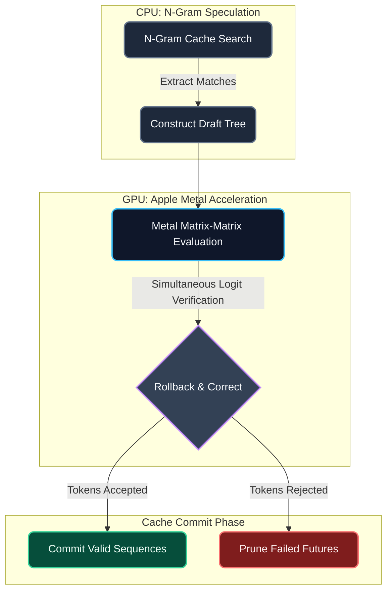
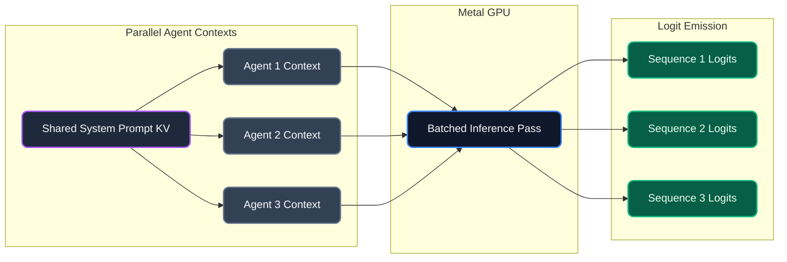
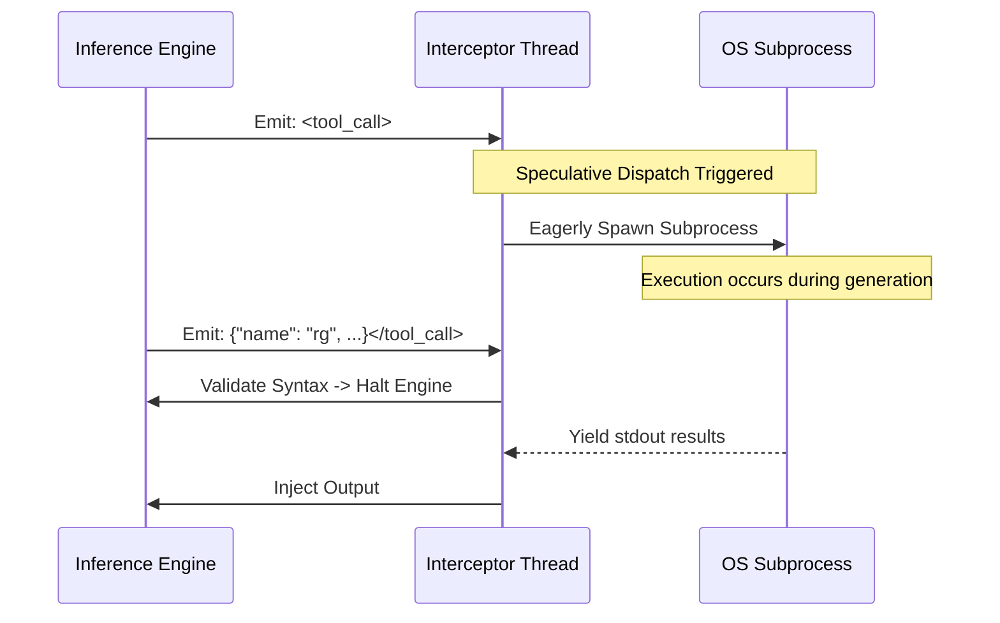
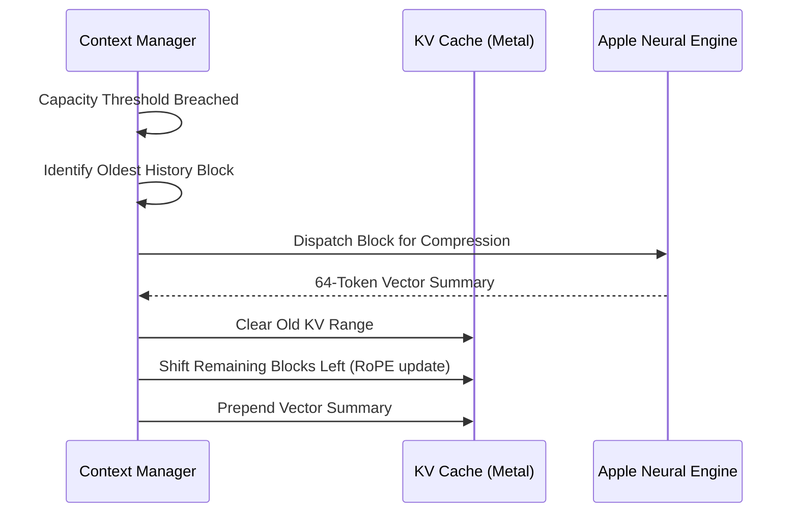
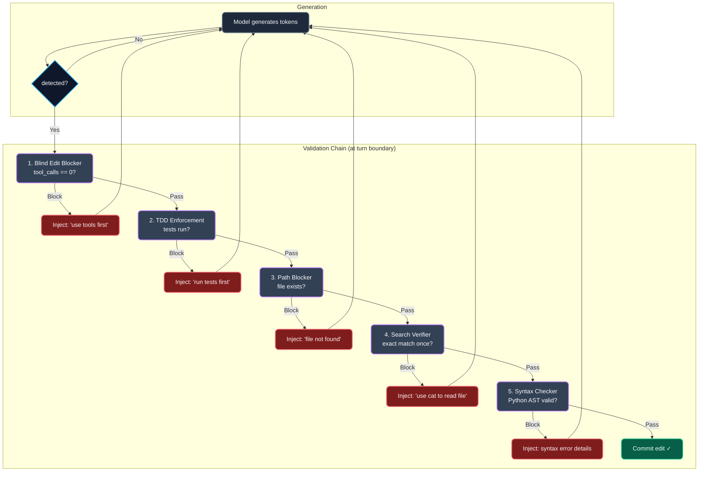
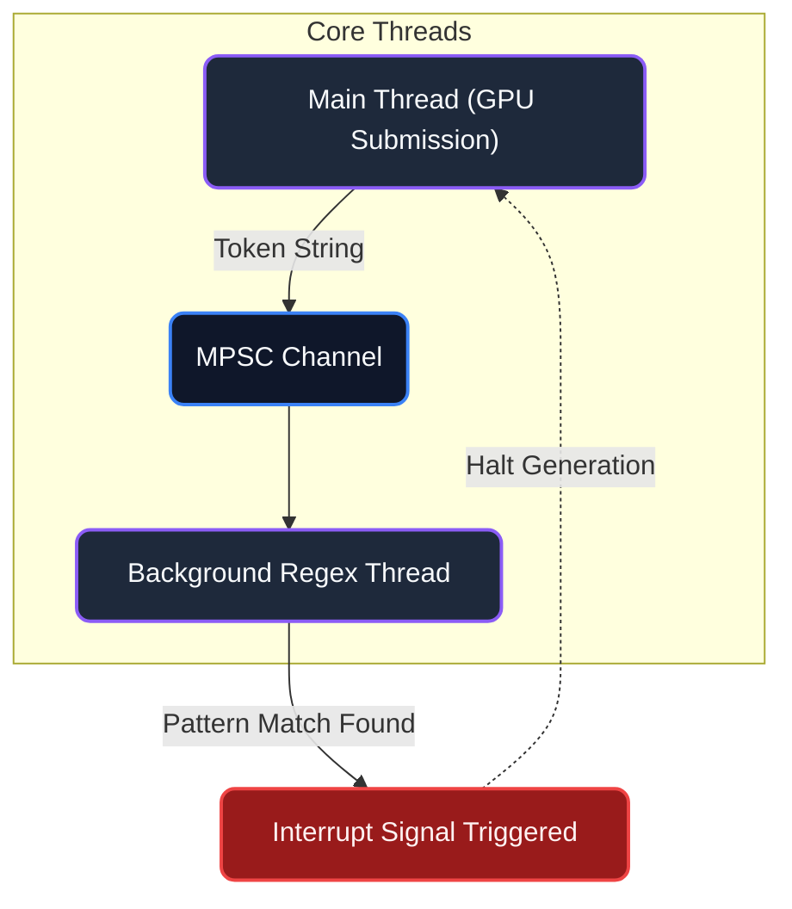
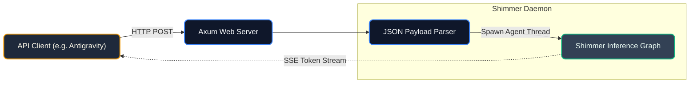

# Architecture Overview

Shimmer is an execution engine for tool-using LLM agents on Apple Silicon. It wraps `llama.cpp` with Metal GPU acceleration, adding streaming tool interception, edit validation, and KV cache compaction inside the inference loop.

The architecture consists of five core sub-systems.

---

## 1. Matrix-Matrix Prompt Lookup Decoding (Tree-PLD)

> **Note (2026-06-21): Disabled for agentic workloads.** n-gram drafts sourced from the system prompt produce token corruption in chat-template responses. Observed: missing `{` and `"` in JSON tool calls, token fusion (`"toolrg"` instead of `{"name": "rg"...}`). Re-enable after a draft-source filter is added that excludes prompt-sourced n-gram matches.

Traditional auto-regressive generation evaluates one token at a time. Shimmer implements a speculative decoding algorithm that uses local N-Gram matching against the KV cache history to construct branching draft trees. These draft trees are evaluated simultaneously on the Metal GPU in a single matrix-matrix operation.



---

## 2. Batched Multi-Agent Swarm Concurrency (MASC)

To bypass the memory bandwidth bottlenecks of single-batch inference, MASC groups $K$ distinct agents into a single forward pass. The context manager shares the underlying System Prompt KV cache across all $K$ sequences, while allocating discrete history tracking for individual agents.



---

## 3. Speculative Tool Execution

Standard agent loops block generation while tools are executed. Shimmer introduces an optimization that eagerly spawns OS subprocesses immediately upon detecting the opening tokens of a tool syntax.



---

## 4. RoPE-Safe KV Compaction & ANE Compression

Shimmer uses page-based KV cache eviction with priority ordering. Tool output pages are evicted first, system prompt and recent history are preserved. RoPE positions are shifted to maintain coherence after compaction. 

If ANE Compression is enabled, ejected blocks are dense-vectorized on the Apple Neural Engine to maintain context constraints.



---

## 5. Edit Validator Pipeline

Shimmer's 6 safety validators operate at turn boundaries (after `</edit>` or EOG), never mid-generation. All use append semantics: feedback is injected as a clean user turn rather than clearing KV cache and inserting tokens mid-stream. This prevents infinite loops caused by interrupting the model's thought chain.



**Key design decision — append vs rollback:** Earlier versions used KV cache rollback (clear + inject mid-generation) which broke speculative decoding compatibility and caused infinite loops when the model was interrupted mid-thought. The current append-only approach means feedback appears as a clean user turn after the model finishes speaking. The cost is increased context usage (failed attempts stay in history), but this is managed by the compaction system.

## 6. Asynchronous Tool Interception

Token output is routed to a detached `std::sync::mpsc` channel. Regex compilation and pattern matching occur on a separate CPU thread, isolating parsing overhead from the primary Metal graph.

The interceptor detects three patterns in the token stream:
- **JSON tool calls:** ````json\n{"name": "...", "arguments": [...]}\n```` → dispatched to tool execution
- **XML edit tags:** `<edit file="...">`, `<search>...</search>`, `<replace>...</replace>`, `</edit>` → routed through the validator pipeline
- **Edit boundary:** `</edit>` closures set `edit_tag_closed` flag for the blind edit blocker



---

## 7. API Server

Shimmer is embedded with an `axum` driven high-performance web server that exposes an OpenAI-compatible `v1/chat/completions` API structure. 



## 8. Agentless Pipeline

New in June 2026 — an alternative evaluation mode that replaces model-driven investigation with a deterministic 3-phase pipeline. Activated via `--agentless` in the Python harness and `--no-tools` in the Rust binary.

```
┌─────────────────────────────────────────────────────────────────┐
│                    AGENTLESS PIPELINE                           │
├─────────────┬──────────────────┬───────────────────────────────┤
│ Phase 1     │ Phase 2          │ Phase 3                       │
│ Localization│ Repair           │ Validation                    │
├─────────────┼──────────────────┼───────────────────────────────┤
│ Python:     │ Python:          │ Python:                       │
│ extract     │ build agentless  │ extract_patch()               │
│ keywords    │ prompt with      │ verify_patch()                │
│ from issue  │ inlined files    │                               │
│     │       │      │           │                               │
│     ▼       │      ▼           │                               │
│ rg grep     │ shimmer          │                               │
│ ranking     │ --no-tools       │                               │
│     │       │ (single-shot)    │                               │
│     ▼       │      │           │                               │
│ ranked      │      ▼           │                               │
│ file list   │ XML edit block   │                               │
└─────────────┴──────────────────┴───────────────────────────────┘
```

**Key architectural difference:** In `--no-tools` mode, `AgentConfig.disable_tool_interceptor = true`. The `ToolInterceptor` gates all JSON tool-call detection behind `detect_json_tools`. Edit tag parsing (`<edit>`, `<search>`, `<replace>`, `</edit>`) continues to run — the model still outputs XML edit blocks. All 6 validators are bypassed (their enable flags are gated on `!args.no_tools` in `create_agent_config()`). The model generates straight through until EOG without interruption.

**File localization** uses regex keyword extraction (file paths, CamelCase, ALL_CAPS, snake_case) followed by `rg` grep to rank files by match count. Files are inlined into the prompt with smart truncation: ≤100 lines shown in full, 100-300 lines show first 30 + last 20, >300 lines show first 30 only. A 48K character budget (~12K tokens) prevents context overflow.
